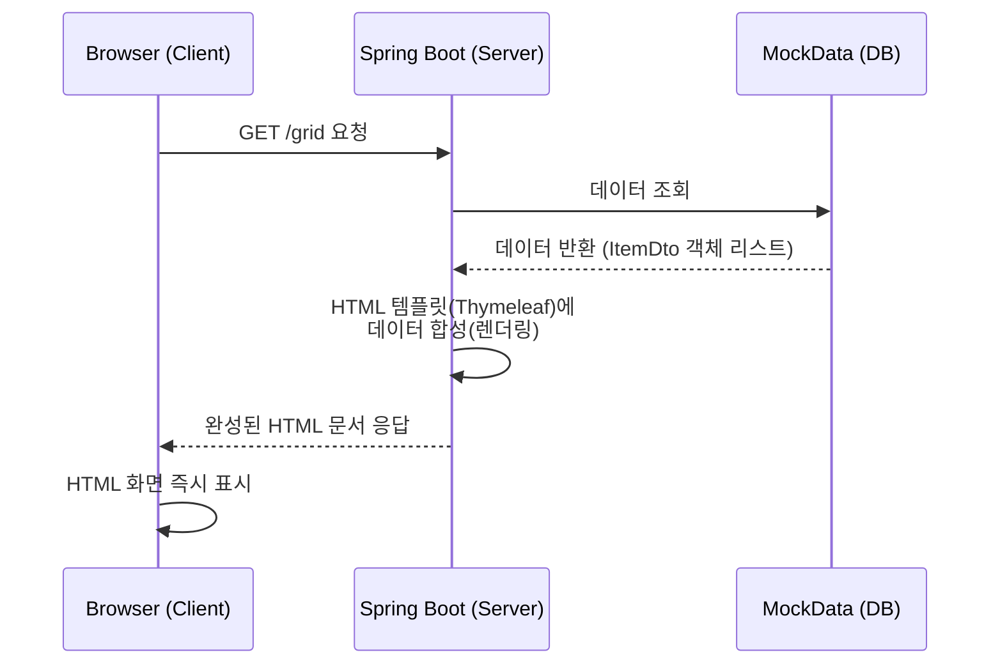
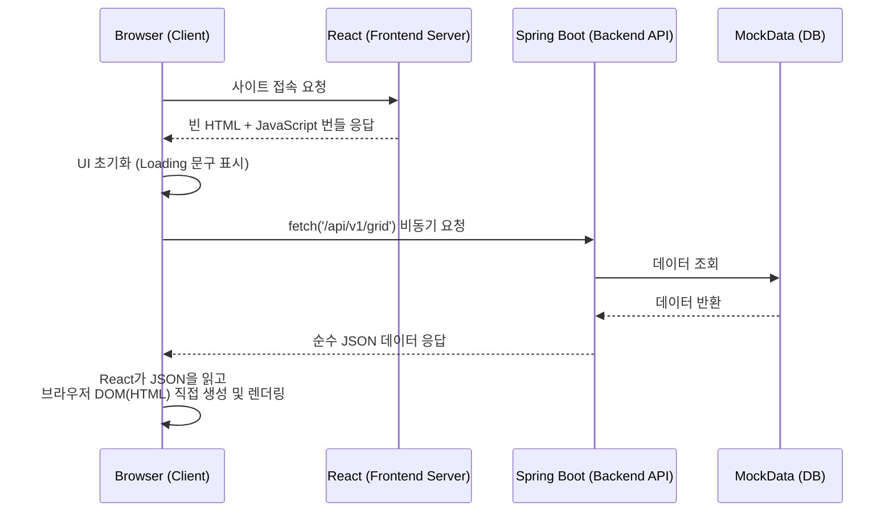

# SSR vs CSR Example Project

이 리포지토리는 웹 애플리케이션의 두 가지 렌더링 방식인 **SSR (Server-Side Rendering)** 과 **CSR (Client-Side Rendering)** 의 차이를 이해하기 위해 구성된 샘플 프로젝트입니다.

동일한 데이터를 바탕으로 **Spring Boot + Thymeleaf (SSR)** 방식과 **Spring Boot REST API + React (CSR)** 방식이 어떻게 다르게 동작하는지 비교해 볼 수 있습니다.

## 프로젝트 구조

```text
ssr-vs-csr-example/
├── backend/    # Spring Boot (Java 17, Gradle)
│   ├── src/main/java/com/example/ssrvscsr/controller/GridController.java       # SSR 용 컨트롤러 (/grid)
│   ├── src/main/java/com/example/ssrvscsr/controller/GridRestController.java   # CSR 용 REST API (/api/v1/grid)
│   └── src/main/resources/templates/grid.html                                  # SSR 템플릿 (Thymeleaf)
└── frontend/   # React (Vite)
    ├── src/components/       # UI 컴포넌트 
    └── src/App.jsx           # 화면 진입점 및 Fetch 호출부
```

## 동작 방식 비교

### 1. SSR (Server-Side Rendering) 



- 기술 스택: **Spring Boot + Thymeleaf**
- 접근 경로: `http://localhost:8080/grid`
- 특징: 
  - 서버(Spring)에서 데이터베이스(또는 Mock Data)를 긁어온 뒤, HTML 템플릿(`grid.html`)에 바로 합성합니다.
  - 브라우저에 완성된 HTML 문서 자체가 내려옵니다. 초기 로딩이 빠르고 SEO(검색 엔진 최적화)에 유리합니다.

### 2. CSR (Client-Side Rendering)



- 기술 스택: **React (Frontend) + Spring Boot (Backend API)**
- 접근 경로: `http://localhost:5174/` (또는 프론트엔드가 실행 중인 로컬 포트)
- 특징:
  - 브라우저는 빈 HTML과 JavaScript 번들을 먼저 다운로드 받습니다.
  - React 애플리케이션이 실행되며 `fetch('/api/v1/grid')` 를 통해 Spring 서버에 순수 JSON 데이터만 요청합니다.
  - 서버로부터 전달받은 JSON 데이터를 바탕으로 클라이언트(브라우저)에서 JavaScript가 화면에 DOM을 그립니다(렌더링).

## 실행 방법

### Backend 실행
1. `backend` 폴더로 이동합니다.
   ```bash
   cd backend
   ```
2. Gradle 래퍼를 이용해 Spring Boot 애플리케이션을 실행합니다.
   ```bash
   ./gradlew bootRun
   ```
3. 서버가 `8080` 포트로 켜집니다.

### Frontend 실행
1. 새로운 터미널을 열고 `frontend` 폴더로 이동합니다.
   ```bash
   cd frontend
   ```
2. 패키지를 설치하고 개발 서버를 띄웁니다.
   ```bash
   npm install
   npm run dev
   ```
3. 안내되는 로컬 포트(예: `5174`)로 접속해 화면을 로딩합니다.
